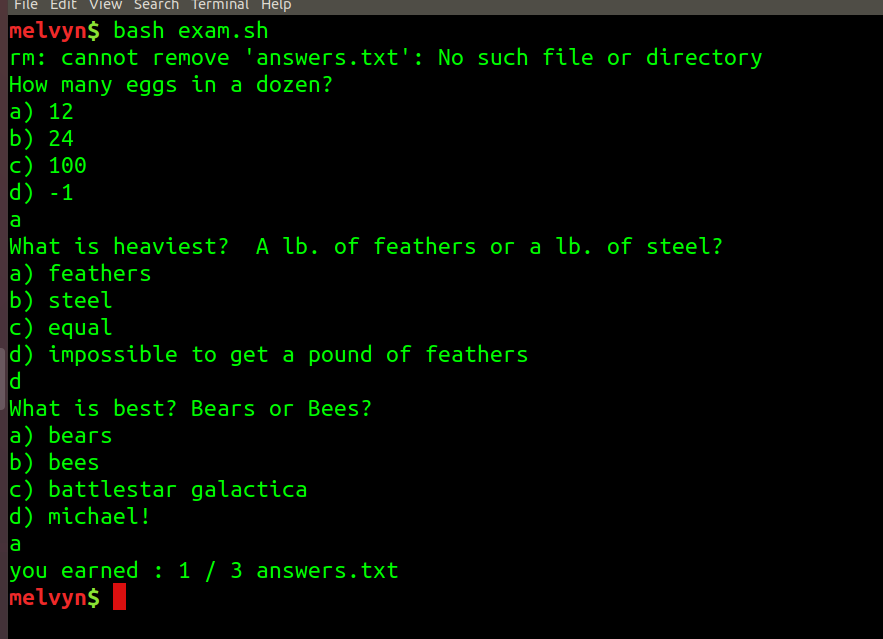

# Midterm!

March 18th 2020. See the Code in this directory.



## Part 1 - Do Over Spring Break
To see the exam in action, type:

```
bash exam.sh
```

and answer the questions. 

Or you can make the file executable and run the exam that way:

```
chmod 755 exam.sh
./exam.sh
```

You will see a file YourName/examQuestions.sh

The file contains 4 functions, `question1()`, `question2()`, `question3()` and
`run_your_questions()`. Using the file MelvynDrag/examQuestions.sh as a
template, write three multiple choice questions that have to do with Linux. If
the user enters the correct answer you should echo "right" into the
$ANSWER\_FILE. If the user enters a wrong answer you should echo "wrong". If the
user enters something invalid, you should ask the user for correct input.

*All you have to do is modify the three questions!* Don't do anything else or
you might break this script that I've carefully put together.


**You must make a PR on this repo containing your three exam questions by March
16th at Midnight**. Your code must work! This is time sensitive, and the whole
class needs you to make these good questions on time so I have a few days to
polish it and work out any kinks before giving the exam on the 18th.

### Protip 
To make your testing faster you can comment out the irrelevant source and run\_students\_questions
lines in the run\_exam function such that only your questions are run. e.g. if
your name is suley, change the code so that onlyyour questions are run.

```
run_exam(){
	// source Melvy....
	//run_melvyns_questions
	// source Juli....
	//run_julians_questions
	source sule....
	run_suleys_questions
	// source xyz....
	//run_xyzs_questions
	//....
}
```

make sure to uncomment those lines before making a PR though.

## Part 2 
Pull changes from my repo into your fork sometime Sunday or Monday.
Complete the exam with me in a zoom call on Tuesday.

## Grading
50% for making good exam questions.
50% of your grade will be from your score on the test.
