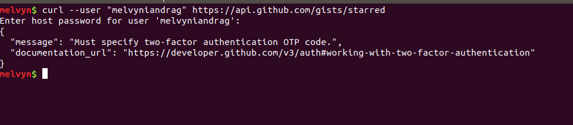

# Week 08 Homework

## Problem 1:
Modify your cron table such that you generate a file called cowtime.txtevery hour. You can get the cow to tell you the time with

```
date | cowsay
``` 

As always, if you don't have `cowsay` on your machine, `apt install` it.

Submit:
* mycrontab.txt
* supporting scripts you wrote to make this work
* screenshot showing a directory containing at least 5 hours worth of cowtime files ( that will be at least 5 files ). Show them with `ls -l` so I can see time stamps and verify that they were created one hour apart.

## Problem 2
Enable 2 factor authentication on your github page and show how to use curl against a 2FA account to access your starred gists.



The 'genesis' of this assignment is that I wanted to do some stuff on github with curl but I couldn't because of 2FA. I haven't figured it out yet and thought we could all sort this out together.

*Note* As I said, I'm not sure how 

Submit:

## Submission Guidelines

Submit all the indicated things on github via pull request. Put your content in 
